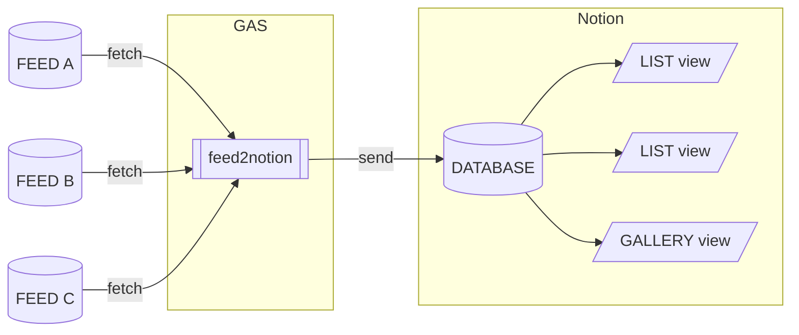
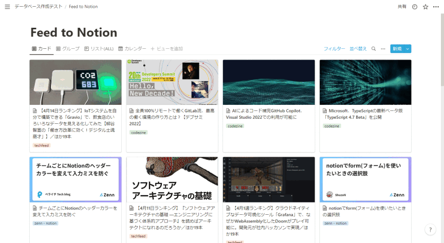

# gas-feed2notion

RSS フィードを Notion データベースへ送信する Google Apps Script ライブラリー。



## Example



## Setup

ライブラリーは App Script で利用できる状態になっています。
Apps Script のコードエディターで以下の手順を実行するとプロジェクトへ追加できます。

1. コードエディターのファイル名一覧が表示される部分の「ライブラリ +」をクリック
1. 「スクリプト ID」フィールドに `1gLGL4oQse_fv1Mm8VfzxmgKOMKvgz592ME4mQSh7Va4MQGxvR6wxdCNl` を入力し検索をクリック
1. バージョンを選択(通常は最新版)
1. 「ID」を `FeedToNotion` へ変更
1. 「追加」をクリック

上記以外にも Release ページから `gas-feed2notion.zip` をダウンロードし、`/dist` ディレクトリーをプロジェクトへコピーできます。

## Usage

Google Apps Script のスクリプトから RSS フィードを取得し Notion のデータベースへ送信する方法です。

### ページを用意

データベースの親になるページを用意します。

### Notion インテグレーションを作成

Notion 外部からデータベースを操作するためのインテグレーション(API KEY)が必要です。以下を参考に作成してください。

- [Getting started # Step 1: Create an integration.](https://developers.notion.com/docs/getting-started#step-1-create-an-integration)

名前は任意ですが後述の通知機能でメンションを行ったユーザーとして表示されます。
機能は以下のように設定します。

- コンテンツ機能 - 「コンテンツを読み取る」「コンテンツを挿入」にチェック
- ユーザー機能 - 通知機能を利用する場合は最低限「メールアドレスなしでユーザー情報を読み取る」が必要

### インテグレーションへの許可

以下を参考に用意したページをインテグレーションと共有してください(データベースをスクリプトで作成するためにページを共有しています)。

- [Getting started # Step 2: Share a database with your integration](https://developers.notion.com/docs/getting-started#step-2-share-a-database-with-your-integration)

### データベースを作成

このリポジトリをローカルへ clone 後、以下のようにスクリプトを実行することで作成できます。
ここで表示される `user_id` と `database_id` は後の設定で利用します。
なお、実行には `jq` が必要です。

```console
$ export NOTION_API_KEY="<API KEY>"
$ export PARENT_PAGE_ID="データベースを作成するページのID"
$ export DATABASE_NAME="作成するデータベースの名前"
$ bash scripts/create_database.sh

user_id: xxxxxxxx-xxxx-xxxx-xxxx-xxxxxxxxxxxx
database_id: xxxxxxxx-xxxx-xxxx-xxxx-xxxxxxxxxxxx
```

手動で作成する場合は以下のプロパティ定義が必要です。

| プロパティ名  | プロパティの種類 |
| ------------- | ---------------- |
| `tags`        | マルチセレクト   |
| `pubDate`     | 日付             |
| `link`        | URL              |
| `既読`        | チェックボックス |
| `description` | テキスト         |
| `guid`        | テキスト         |

### Google Apps Script で実行

スタンドアロンのスクリプトを作成し、以下の手順を実行してください。

1. スクリプトプロパティに `notion_api_key` `database_id` を追加
1. 「Setup」の手順でライブラリーを追加
1. スクリプトファイルへ以下のようなコードを追加
   - `settings_()` の `opts.feeds` 配列にフィード情報を記述します
1. `feed2notion` を関数を実行する
   - 実行時にスクリプトへの許可を確認されます、内容を確認して安全だと確信できたら許可してください

```js
function settings_() {
  const props = PropertiesService.getScriptProperties()
  const apiKey = props.getProperty('notion_api_key')
  const database_id = props.getProperty('database_id')
  const opts = {
    database_id,
    feeds: [{ name: 'feed name', url: 'feed url' }],
    limit: 10
  }
  return {
    apiKey,
    opts
  }
}

function feed2notion() {
  const settings = settings_()
  FeedToNotion.send(settings.apiKey, settings.opts)
}
```

しばらく待つと Notion のデータベースにフィードの情報が追加されます。

追加されない場合は以下のような原因が考えられます。

- 指定されたフィードのフォーマットに対応していない - gas-feed2notion はフィードの取り扱いが安定していないのでエラーが発生しやすいです
- 3 日以内に更新されたページがない - デフォルトでは 3 日以内の記事のみを Notion へ送信します
- フィードのサーバーが地域などを制限 - Google Apps Script が実行されるサーバーの地域からの接続を制限されている場合があります

### og:image

フィードに画像が登録されてれいない場合、各ページ og:image の URL を取得しています。以下のようにコードを変更することで無効化できます。

```js
function settings_() {
  const props = PropertiesService.getScriptProperties()
  const apiKey = props.getProperty('notion_api_key')
  const database_id = props.getProperty('database_id')
  const opts = {
    database_id,
    feedTransfomers: [],
    feeds: [{ name: 'feed name', url: 'feed url' }],
    limit: 10
  }
  return {
    apiKey,
    opts
  }
}

function feed2notion() {
  const settings = settings_()
  FeedToNotion.send(settings.apiKey, settings.opts)
}
```

### キーワード指定による通知

以下のようにコードを変更することで「フィード内に指定されたキーワードが存在していたらメンションを行う」設定をできます。
結果としてメンションが行われたと通知されるようになります。

1. スクリプトプロパティに `notify_user_id` を追加
   - 「データベースを作成」で利用したページの作成者へ通知する場合、スクリプト実行時に表示された `user_id` を指定できます
1. スクリプトのコードを以下のように変更

```js
function settings_() {
  const props = PropertiesService.getScriptProperties()
  const apiKey = props.getProperty('notion_api_key')
  const database_id = props.getProperty('database_id')
  const notify_user_id = props.getProperty('notify_user_id')
  const w2m = FeedToNotion.getWordsToMentionParamTeransFormer()(
    ['keyword1', /keyword2/i],
    notify_user_id
  )
  const opts = {
    database_id,
    paramTransfomers: [...FeedToNotion.presetParamTransformers(), w2m],
    feeds: [{ name: 'feed name', url: 'feed url' }],
    limit: 10
  }
  return {
    apiKey,
    opts
  }
}

function feed2notion() {
  const settings = settings_()
  FeedToNotion.send(settings.apiKey, settings.opts)
}
```

## Transformer

Transformer 関数(ジェネレーター関数)を作成することで Notion のデータベースへ追加されるフィードの情報を変更できます。

以下は上記で利用している通知機能を実現する Transformer のソースコードです。

```ts
export function getWordsToMentionParamTeransFormer(
  words: (string | RegExp)[],
  userId: string
): FeedToNotion.ParamTransfomer {
  return function* (
    ite: Generator<[CreatePageParameters, FeedToNotion.FeedItem, string]>
  ): Generator<[CreatePageParameters, FeedToNotion.FeedItem, string]> {
    for (const [param, item, xmlText] of ite) {
      if (
        words.some(
          (w) =>
            item.title.match(w) ||
            item.description.match(w) ||
            item.feedName.match(w)
        )
      ) {
        param.children?.unshift({
          object: 'block',
          type: 'paragraph',
          paragraph: {
            rich_text: [
              {
                type: 'mention',
                mention: {
                  user: {
                    id: userId
                  }
                }
              }
            ]
          }
        })
      }
      yield [param, item, xmlText]
    }
  }
}
```

## TypeScript

TypeScript(clasp) でコードを記述している場合は、`@hankei6km/gas-feed2notion` を import することで型定義を利用できます。

```console
$ npm install --save-dev @hankei6km/gas-feed2notion
```

## License

MIT License

Copyright (c) 2022 hankei6km
